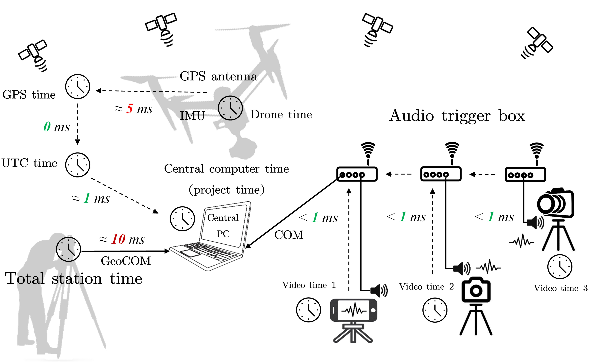

# drone-tracking-toolkits
This repository is for the IPA project [Measuring Drone Trajectory using Total Station with Visual Tracking](https://sirop.org/app/f76aed5f-95af-43db-a302-47ae994b03be) at ETH IGP. 

Student: Yue Pan

Supervisor: Dr. Cenek Albl, et al.

---

[**[Presentation slide]**](https://github.com/YuePanEdward/drone-tracking-toolkits/blob/main/doc/IPA_presentation-YuePan-20201217.pdf) [**[Report]**](https://github.com/YuePanEdward/drone-tracking-toolkits/blob/main/doc/IPA_report-YuePan-Measuring_Drone_Trajectory_using_Total.pdf)

----

### Dataset acquired using the toolkit

*Drone tracking and trajectory reconstruction dataset* [**[link to the dataset]**](https://github.com/CenekAlbl/drone-tracking-datasets)


### Overview of the subcentimeter accuracy localization of the drone 
 

### Overview of the joint synchronization


-----
### How to use:
The codes are written in Matlab (R2019b). 

0. Prepare instruments [(checklist)](https://github.com/YuePanEdward/drone-tracking-toolkits/blob/main/doc/experiment_checklist.pdf):

Leica total station with GeoCOM

Drone assembled with Pixhawk and Leica 360 ° prism

Radio-synchronized network of audio triggers

1. Measurements on site:

Run ```codes\measure\tps_geocom\main_tps.m``` to realize total station tracking via [GeoCOM](http://webarchiv.ethz.ch/geometh-data/student/eg1/2010/02_deformation/TPS1200_GeoCOM_Manual.pdf).

Run ```codes\measure\radio_sync\audio_trigger_auto.m``` to launch the radio-synchronized audio triggering system for joint synchronization.

2. Data post-processing:

Run ```codes\postprocess\pose\drone_data_loader.m``` to load the drone log file in [Pixhawk](https://pixhawk.org/) format.

Run ```codes\postprocess\pose\get_tran_lt.m``` to accomplish resection (transformation from the total station frame to local ENU frame).

Run ```codes\postprocess\pose\get_drone_pose.m``` to estimate the drone's pose in local ENU frame using total station and onboard sensors' measurements.

-----

#### Useful links:

[Drone tracking and trajectory reconstruction dataset](https://github.com/CenekAlbl/drone-tracking-datasets)

[Reconstruction of 3D flight trajectories from ad-hoc camera networks (IROS '20)](https://arxiv.org/abs/2003.04784)[[Codes]]((https://github.com/CenekAlbl/mvus))

#### Acknowledgement:

Special thanks to Prof. Dr. Konrad Schindler, Dr. Cenek Albl, Dr. Jemil Butt, Andreas Baumann-Ouyang, Alexander Wolf, Thomas Posur, Tom Manu, Usvyatsov Mikhail and Mudathir Awadaljeed from [ETH Zurich Institute of Geodesy and Photogrammetry](https://igp.ethz.ch/) for the supervision, advice and help during the project.
